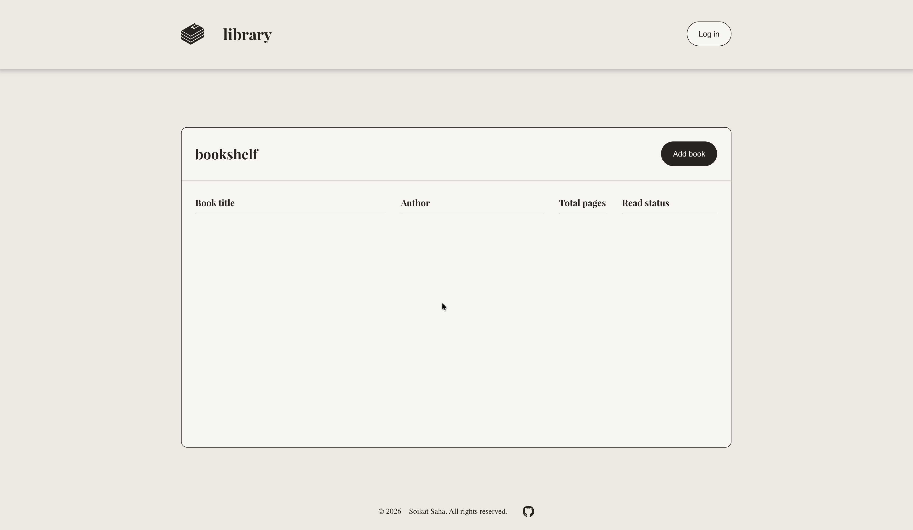

# Book Library WebApp

A small browser app for keeping track of books on a simple “bookshelf” layout. You can add titles with author, page count, and whether you’ve read them, then flip read status or remove rows when you’re done with them.

There’s no backend here yet (`coming soon!`) — everything lives in memory while the tab is open. The UI is plain HTML and CSS with a native `<dialog>` for the add-book form, plus a header/footer layout that stays easy to read on different screen sizes.

This was built as a learning / portfolio piece (thanks to **The Odin Project** community for the guidance, but with my own styling). If you’re poking at the code, you’ll see how the book model is wired to the DOM with event delegation, and how the modal form stays separate from the list rendering.

<p align="center">
  
</p>

#### Key engineering concepts used in this project

- Constructor + prototype pattern for `Book` instances (`toggleReadStatus`, stable `id` via `crypto.randomUUID()`)
- Event-driven UI: form submit, dialog open/close, delegated clicks for remove + read checkbox
- Native `<dialog>` for the add-book flow (no extra modal library)
- Layout and typography handled in CSS (custom font, shelf-style table)

## Getting Started

### **Try it online**

**Live app:** [https://soikat27.github.io/book-library-web](https://soikat27.github.io/book-library-web) – opens in the browser, nothing to install.

### **Run it locally** (if you’re cloning or tweaking the code)

You don’t need Node, a bundler, Python, or any local server right now – just a browser and a copy of the files.

#### **Prerequisites**

- A **modern browser** (recent Chrome, Firefox, Safari, or Edge is fine)
- **Git** (only if you use `git clone` below; otherwise you can use GitHub’s **Code → Download ZIP**)

#### Check that Git is installed (only if you clone)

```bash
git --version
```

#### **Installing**

##### 1. Clone this repository and open the project directory

```bash
git clone https://github.com/soikat27/book-library-web.git
```

```bash
cd book-library-web
```

There’s no `npm install` or compile step – just HTML, CSS, and JS in the repo root.

#### **Running locally**

Open `index.html` in your browser (double-click or drag it into a window).

## Using the app

The same behavior applies on the [live demo](https://soikat27.github.io/book-library-web/) and when you run files locally.

### Features

- **Add book** — title, author, total pages, “have you read it?” checkbox
- **Read status** — toggle per row; stays in sync with the in-memory book object
- **Remove** — delete a row and remove it from the internal list
- **Log in** — placeholder for now (shows a “not available yet” message). <u>However, this feature will be live soon!!!</u>

### Usage

- Click **Add book**, fill the form, submit to append a row to the shelf
- Use the **read** checkbox on a row to flip read / unread
- Use **remove** on a row to delete that book from the list

### Upcoming features

- Persist the library (e.g. `localStorage` or a small API) so refreshes don’t wipe data
- Real sign-in / accounts as this will grow beyond a toy app
- Sorting or filtering (by author, read vs unread, etc.)

## Deployment

It’s static files only. This repo is served with **GitHub Pages** at [https://soikat27.github.io/book-library-web](https://soikat27.github.io/book-library-web) (publish from the repo root, no build step). You could also host the same files on Netlify, Cloudflare Pages, or any static host.

## Built with

- Plain **HTML**, **CSS**, and **JavaScript** (no framework)
- **`Book` constructor** + prototype methods for behavior
- **`<dialog>`** for the add-book modal
- **`crypto.randomUUID()`** for per-book ids

## Contributing

Contributions are welcome and highly appreciated! Open an issue or send a PR if you want to add persistence, tighten the UI, or teach me something I missed.

## Author

- **Soikat Saha** — design and implementation

## License

This project is licensed under the MIT License — see the [LICENSE](LICENSE) file for details.

## Acknowledgments

- Shoutout to the **Odin Project** community and curriculum for the initial guidance.
- Thanks to everyone who writes solid **MDN** docs – it does get opened a lot!
- The boring vanilla HTML, CSS, and JavaScript is on purpose – fits a learning-style project and keeps the JS and DOM straightforward for anyone reading the repo.